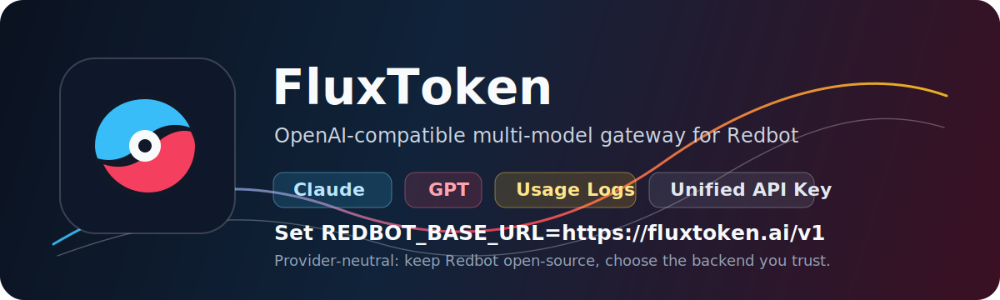

<div align="center">

# Redbot

### 面向可重复知识工作的本地优先 AI 执行助理

[](LICENSE)
[](pyproject.toml)
[](https://github.com/RedStringAI/Redbot/actions/workflows/ci.yml)
[](docs/openai-compatible.md)
[](docs/local-client.md)

### 官方仓库：**[github.com/RedStringAI/Redbot](https://github.com/RedStringAI/Redbot)**

[English](README.md) | 中文 | [日本語](README_JA.md) | [Deutsch](README_DE.md) | [FluxToken](docs/fluxtoken.md)

</div>

## 赞助 / 推荐网关

<details open>
<summary>推荐的 OpenAI-compatible 模型中转站</summary>

[](https://fluxtoken.ai)

<table>
<tr>
<td width="180"><strong>FluxToken</strong><br><a href="https://fluxtoken.ai">fluxtoken.ai</a></td>
<td>
Redbot 不绑定任何一家模型服务，只要是 OpenAI-compatible endpoint 都能接。如果你想做生产测试、文档工作流，或者在 Claude / GPT 等主流模型之间切换，可以使用 <a href="https://fluxtoken.ai">FluxToken</a>。FluxToken 基于多模型 API 网关能力，提供统一 API Key、余额管理、使用日志和渠道路由。
<br><br>
配置方式很简单：把 <code>REDBOT_BASE_URL</code> 设为 <code>https://fluxtoken.ai/v1</code>，再填入你的 FluxToken API Key 即可。Redbot 仍然保持开源和中立，也可以接 OpenAI、OpenRouter、自建 New API、本地模型服务或任何兼容中转站。
</td>
</tr>
</table>

</details>

## Redbot 是什么

Redbot 是一个开源个人 AI 执行助理。它不是让你每次从空白聊天开始，而是把高频知识工作做成可复用模板：资料研究、沟通脚本、内容表格、周报、GitHub README 草稿。

- **模板优先**：直接从真实研究、办公、开发者场景开始。
- **兼容主流模型网关**：OpenAI、FluxToken、OpenRouter、自建中转站、本地模型服务都可以。
- **可追踪执行**：每次运行都会保存最终产物和 JSON trace。
- **本地客户端**：支持浏览器控制台和本地 HTTP 服务。
- **飞书 / 企业微信 / 微信入口**：提供 webhook adapter，方便接入团队群和机器人桥。
- **记忆和知识库**：SQLite 存储用户偏好，本地 `.md` / `.txt` 文件可导入检索。
- **MIT 开源**：便于审计、扩展、自托管和团队内部二次开发。

## 快速开始

```bash
python -m venv .venv
.venv\Scripts\activate
pip install -e .
redbot templates
redbot run research-brief --topic "Claude vs GPT" --audience "工程团队" --context "比较模型在内部工具中的适用场景" --demo
```

启动本地桌面式控制台：

```bash
redbot desktop --demo --port 8765
```

打开：

```text
http://127.0.0.1:8765
```

## 接入真实模型

Redbot 请求标准 chat-completions 接口：

```text
POST {REDBOT_BASE_URL}/chat/completions
```

FluxToken 示例：

```powershell
$env:REDBOT_API_KEY="ft-your-key"
$env:REDBOT_BASE_URL="https://fluxtoken.ai/v1"
$env:REDBOT_MODEL="gpt-4o-mini"
```

OpenAI 示例：

```powershell
$env:REDBOT_API_KEY="sk-your-key"
$env:REDBOT_BASE_URL="https://api.openai.com/v1"
$env:REDBOT_MODEL="gpt-4o-mini"
```

运行：

```bash
redbot run research-brief --topic "开源 AI Agent 趋势" --audience "工程团队" --context "总结实际落地风险和下一步动作"
```

更多说明：[OpenAI-compatible setup](docs/openai-compatible.md) 和 [FluxToken setup](docs/fluxtoken.md)。

## 内置模板

| 模板 | 输出 |
|---|---|
| `research-brief` | 选题研究、角度、风险和下一步动作 |
| `short-video-script` | 带清晰开头和结构的短沟通脚本 |
| `content-table` | 把杂乱笔记整理成内容表格 |
| `weekly-report` | 把进展记录整理成周报 |
| `github-readme` | 为开源项目生成 README 草稿 |

## 本地客户端

```bash
redbot serve --demo --port 8765
```

常用命令：

```text
/templates
/run research-brief Claude 和 GPT 模型对比
/remember style=输出要简洁、技术口径清晰
/memory
/kb add 飞书配置
/kb search 飞书
```

Webhook 入口：

| 平台 | Endpoint |
|---|---|
| 飞书 | `/webhook/feishu` |
| 企业微信 | `/webhook/wecom` |
| 微信公众号 | `/webhook/wechat` |
| 通用机器人桥 | `/webhook/generic` |

查看：[本地客户端](docs/local-client.md) 和 [渠道接入](docs/channels.md)。

## 知识库

导入本地资料：

```bash
redbot kb import ./docs --workspace redbot_workspace
```

在控制台或任意渠道中搜索：

```text
/kb search 模型中转站
```

当前版本刻意保持轻量：SQLite 存储 + 关键词检索。后续可以加 embeddings 和向量搜索，但命令接口会尽量保持简单。

## 路线图

- 更多资料研究、团队更新、客服知识、项目文档模板。
- 更完整的 Web 控制台。
- 内置网页研究工具。
- PDF、DOCX、会议记录导入。
- 定时任务和自动化工作流。
- 可选向量检索。

## 和 nanobot 的区别

[nanobot](https://github.com/HKUDS/nanobot) 是更完整的个人 AI Agent 框架，覆盖 WebUI、渠道、工具、记忆、MCP、自动化和部署。Redbot 更像一个轻量、产品化、面向知识工作的执行助手：

- 首次体验更窄、更容易讲清楚；
- 更偏研究、文档和办公协作场景；
- 本地产物和 trace 是主要产品表面；
- OpenAI-compatible 配置足够简单；
- 代码体量更适合审计、扩展和自托管。

## 开发

```bash
PYTHONPATH=src python -m unittest discover -s tests -v
```

## 许可证

Redbot 使用 MIT License 开源，见 [LICENSE](LICENSE)。

## 致谢

Redbot 受到 MIT 许可证项目 [HKUDS/nanobot](https://github.com/HKUDS/nanobot) 启发。详见 [NOTICE.md](NOTICE.md)。
