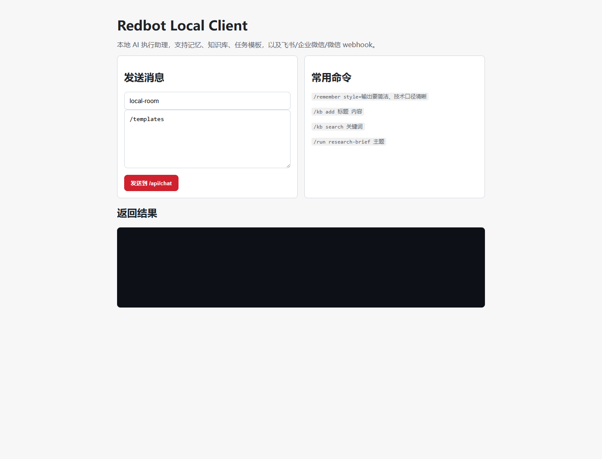
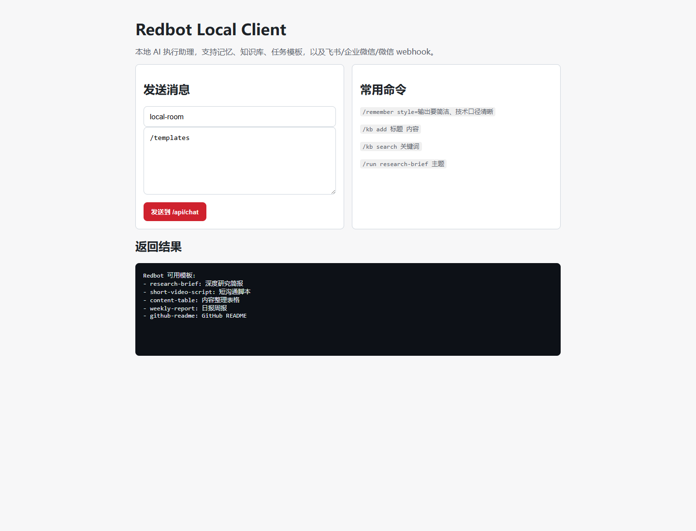
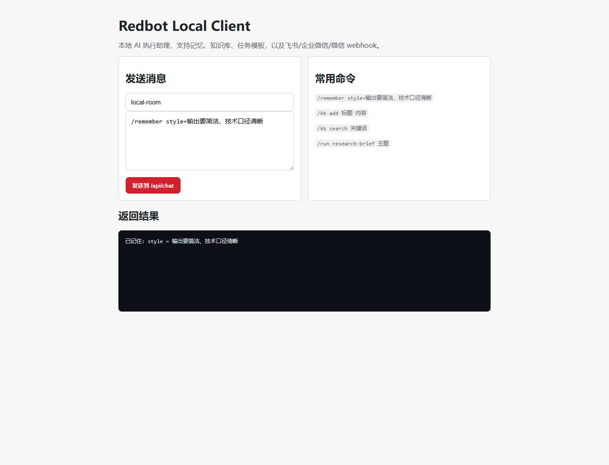
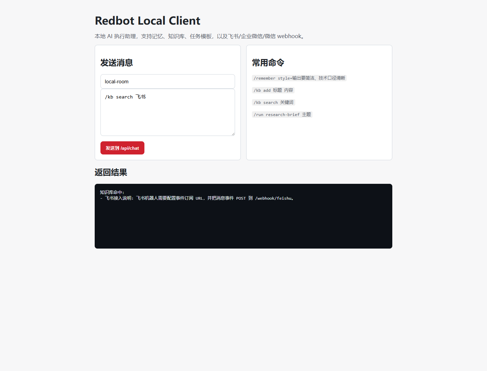
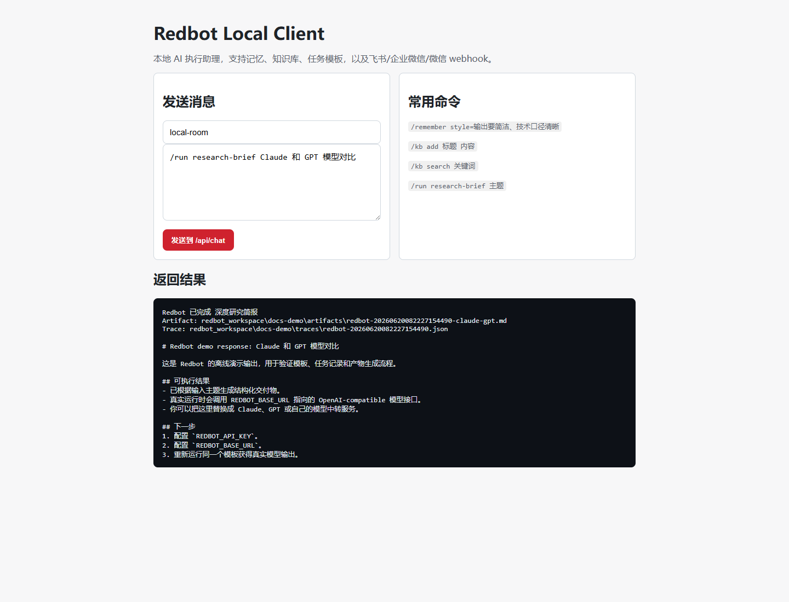
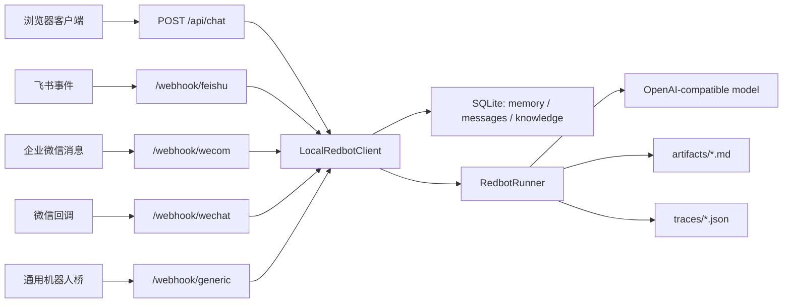

# Redbot 客户端截图与技术文档

本文说明 Redbot 本地客户端的启动方式、页面操作、命令能力、数据流和渠道接入方式。Redbot 的核心定位是本地优先的 AI 执行助理：浏览器页面负责输入和查看结果，后端负责模板执行、记忆、知识库、产物保存和 webhook 接入。

## 快速启动

安装并启动 demo 模式：

```bash
python -m venv .venv
.venv\Scripts\activate
pip install -e .
redbot serve --demo --port 8765
```

打开本地客户端：

```text
http://127.0.0.1:8765
```

如果希望启动后自动打开浏览器，可以使用桌面式入口：

```bash
redbot desktop --demo --port 8765
```

demo 模式不需要模型 API Key，适合验证页面、命令、产物和 webhook 数据流。接入真实模型时，配置 OpenAI-compatible endpoint：

```powershell
$env:REDBOT_API_KEY="your-api-key"
$env:REDBOT_BASE_URL="https://your-openai-compatible-endpoint/v1"
$env:REDBOT_MODEL="gpt-4o-mini"
redbot serve --port 8765
```

FluxToken 是可选的 OpenAI-compatible 多模型网关。如果你需要在 Claude / GPT 等模型之间切换，可以这样配置：

```powershell
$env:REDBOT_API_KEY="ft-your-key"
$env:REDBOT_BASE_URL="https://fluxtoken.ai/v1"
$env:REDBOT_MODEL="gpt-4o-mini"
redbot serve --port 8765
```

Redbot 不绑定具体模型服务，也可以接 OpenAI、OpenRouter、自建 New API、本地模型服务或其他兼容网关。

## 客户端页面

启动后，首页会显示消息输入区、常用命令和返回结果区。默认消息会发送到 `/api/chat`，后端将它转换成 Redbot 的统一文本调用。



页面字段说明：

| 区域 | 作用 |
|---|---|
| `conversation` 输入框 | 当前会话 ID，用于区分不同房间、群聊或用户上下文 |
| 消息输入框 | 输入 `/templates`、`/run`、`/remember`、`/kb` 等命令 |
| 发送按钮 | 将消息 POST 到 `/api/chat` |
| 返回结果 | 显示 Redbot 的文本回复、产物路径和 trace 路径 |

## 客户端操作流程

1. 在终端启动 `redbot serve --demo --port 8765`。
2. 在浏览器打开 `http://127.0.0.1:8765`。
3. 在消息输入框输入 `/templates`。
4. 点击 `发送到 /api/chat`。
5. 在返回结果区查看可用模板。

模板列表返回示例：



保存当前会话偏好：

```text
/remember style=输出要简洁、技术口径清晰
```



写入知识库后搜索：

```text
/kb add 飞书接入说明
飞书机器人需要配置事件订阅 URL，并把消息事件 POST 到 /webhook/feishu。
```

```text
/kb search 飞书
```



执行一个任务模板：

```text
/run research-brief Claude 和 GPT 模型对比
```

返回结果会包含三类信息：任务状态、产物文件路径、JSON trace 文件路径，以及一段可直接阅读的输出内容。



## 命令参考

| 命令 | 示例 | 说明 |
|---|---|---|
| `/help` | `/help` | 查看本地客户端支持的命令 |
| `/templates` | `/templates` | 列出内置任务模板 |
| `/run` | `/run research-brief Claude 和 GPT 模型对比` | 按模板执行任务，并生成本地产物和 trace |
| `/remember` | `/remember style=输出要简洁、技术口径清晰` | 保存当前用户在当前会话里的偏好 |
| `/memory` | `/memory` | 查看当前作用域下的记忆 |
| `/kb add` | `/kb add 标题` 后接正文 | 将一段资料写入本地知识库 |
| `/kb search` | `/kb search 飞书` | 从本地知识库检索相关资料 |

## 技术架构

Redbot 的客户端和渠道适配层都进入同一个本地执行核心。这样浏览器、飞书、企业微信、微信桥接服务都可以复用同一套模板、记忆、知识库和产物保存逻辑。



核心模块：

| 模块 | 职责 |
|---|---|
| `redbot.server.RedbotLocalApp` | 启动本地 HTTP 服务，注册 `/api/chat` 和 webhook 路由 |
| `redbot.client.LocalRedbotClient` | 解析命令、读写记忆、检索知识库、调用任务执行器 |
| `redbot.runner.RedbotRunner` | 根据模板组织 prompt，调用模型并保存产物和 trace |
| `redbot.store.RedbotStore` | 使用 SQLite 存储消息、记忆和知识库内容 |
| `redbot.channels` | 处理飞书、企业微信、微信和通用桥接 payload |
| `redbot.llm.OpenAICompatibleClient` | 请求标准 `chat/completions` 接口 |

## 本地数据

默认工作目录：

```text
redbot_workspace/
  redbot.db
  artifacts/
  traces/
  desktop-status.json
```

说明：

| 路径 | 内容 |
|---|---|
| `redbot.db` | SQLite 数据库，保存消息、记忆和知识库 |
| `artifacts/` | 每次任务的最终 Markdown 产物 |
| `traces/` | 每次任务的 JSON 执行记录 |
| `desktop-status.json` | `redbot desktop` 写入的本地 URL 和 webhook URL |

如果要隔离不同项目的数据，可以指定工作目录：

```bash
redbot serve --demo --port 8765 --workspace ./redbot_workspace_demo
```

## HTTP 接口

本地客户端调用：

```bash
curl -X POST http://127.0.0.1:8765/api/chat \
  -H "content-type: application/json" \
  -d "{\"channel\":\"local\",\"conversation_id\":\"room\",\"user_id\":\"user\",\"text\":\"/templates\"}"
```

请求字段：

| 字段 | 说明 |
|---|---|
| `channel` | 来源渠道，例如 `local`、`feishu`、`wecom`、`wechat-bridge` |
| `conversation_id` | 会话或群聊 ID |
| `user_id` | 用户 ID |
| `text` | 用户输入的命令或普通文本 |

返回：

```json
{
  "reply": "Redbot 可用模板:\n- research-brief: 深度研究简报\n..."
}
```

健康检查：

```text
GET /health
```

返回当前服务状态和已注册渠道。

## 渠道接入

Redbot 预留了四个 webhook 入口：

| 平台 | Endpoint | 用途 |
|---|---|---|
| 飞书 | `/webhook/feishu` | 接收飞书事件订阅中的消息事件 |
| 企业微信 | `/webhook/wecom` | 接收企业微信或桥接服务转发的 JSON 文本消息 |
| 微信公众号 | `/webhook/wechat` | 支持 GET token 校验和 XML 文本回调 |
| 通用机器人桥 | `/webhook/generic` | 接入第三方机器人桥或自定义脚本 |

飞书配置要点：

```text
https://your-domain/webhook/feishu
```

本地开发时，飞书需要访问公网 URL。可以使用 Cloudflare Tunnel、ngrok 或服务器反向代理把公网地址转到本地 `8765` 端口。

企业微信 JSON 示例：

```json
{
  "chatid": "group-1",
  "from": { "userid": "user-1" },
  "text": { "content": "/templates" }
}
```

通用桥接 JSON 示例：

```json
{
  "channel": "wechat-bridge",
  "conversation_id": "room-1",
  "user_id": "sender-1",
  "text": "/run weekly-report 本周项目进展"
}
```

## 生产部署提示

- 给外部 webhook 配置 HTTPS 和固定域名。
- 在网关或反向代理层处理鉴权、签名校验、IP 白名单和访问日志。
- 将 `redbot_workspace/` 放在持久化磁盘，不要提交到 Git。
- 为不同团队或项目使用不同 `--workspace`。
- 真实模型模式需要保护 `REDBOT_API_KEY`，不要写入公开文件。
- 需要主动推送到飞书或企业微信群时，配置对应平台的 outbound 环境变量。

## 排查

| 现象 | 检查项 |
|---|---|
| 页面打不开 | 确认 `redbot serve` 仍在运行，端口是否是 `8765` |
| 返回 `not found` | 确认访问的是 `/`、`/api/chat` 或已支持的 webhook endpoint |
| 真实模型无输出 | 检查 `REDBOT_API_KEY`、`REDBOT_BASE_URL`、`REDBOT_MODEL` |
| webhook 收不到消息 | 确认平台能访问公网 URL，并转发到本地端口 |
| 知识库搜不到 | 先用 `/kb add` 或 `redbot kb import` 写入资料 |

